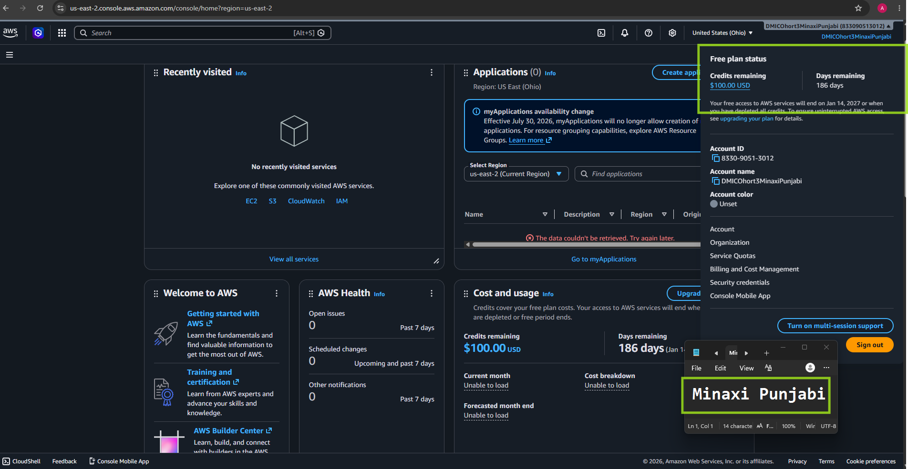

# Assignment 1 — AWS Free Tier Account Setup (EpicReads Cloud Onboarding)

Part of the DevOps Micro Internship (DMI) Cohort 3 with Agentic AI

---

## Purpose

In this assignment, you will create and verify an AWS Free Tier account as part of onboarding EpicReads — an online bookstore moving to the cloud. You will demonstrate an understanding of AWS fundamentals, Free Tier services, and account setup by answering conceptual questions and capturing proof of a working AWS Console login.

---

# Task 1 — Understanding AWS & Free Tier

## Goal

Demonstrate understanding of AWS basics and Free Tier usage by answering the following questions in your own words (3–4 lines each).

### Answers

#### Question 1 — What is an AWS account, and why do you need it at this stage?

Write your answer here.

---

#### Question 2 — What is AWS Free Tier, and how long does it last?

Depending on the trial offer it can be  a month, 6 months or longer. The constraint is time + Credits available for various services. If one goes above the free usage limit then there will be no more availability of additional service irrespective of time left on the trial period. 

---

#### Question 3 — Name three AWS Free Tier services and their free usage limits.

Amazon S3 The Free Tier offers 5 GB of standard storage, along with 20,000
GET requests and 2,000 PUT requests per month, as long as usage stays within these limits.
I
Amazon EC2 is a virtual server service that lets users run applications on cloud-hosted
machines instead of physical hardware. The Free Tier provides 750 hours per month of a
t2.micro or t3.micro instance - enough to run one small server continuously for a full month,
ideal for learning, testing, and hosting basic applications.

Amazon DynamoDB is a fully managed NoSQL database service used to store and query data
at scale. Its Free Tier is "Always Free" and never expires, offering 25 GB of storage plus 25
provisioned read and write capacity units per month, enough to handle roughly 200 million
requests monthly.

---

# Task 2 — Create AWS Free Tier Account

## Goal

Create a valid AWS Free Tier account and sign in to the AWS Management Console.

> No screenshots required for this task. Completion is verified through Task 3.

---

# Task 3 — Verify AWS Account

## Goal

Confirm that your AWS account setup is complete by navigating to the Account section and capturing proof.

### Evidence

#### Screenshot 1 — AWS Account page showing account name (email may be blurred)

---

# Submission Instructions

- Add all required screenshots in your GitHub repository submission
- Full name must be visible in required screenshots
- Do not expose sensitive information (keys, passwords, account IDs)

---

# Completion Checklist

- [ ] Task 1 answers written in own words
- [ ] AWS Free Tier account created successfully
- [ ] Signed in to AWS Management Console
- [ ] Screenshot of AWS Account page captured (full name visible, no sensitive data)
- [ ] All required screenshots added to repository

---

## 📌 About DMI & CloudAdvisory

DevOps Micro Internship (DMI) is a project-based DevOps program run by Pravin Mishra (The CloudAdvisory) focused on real-world execution, systems thinking, and career readiness.

It helps learners build strong DevOps foundations with hands-on experience.

---

## 📌 Resources

- 🌐 DMI Official Website: https://pravinmishra.com/dmi  
- 🎓 DevOps for Beginners (Udemy): https://www.udemy.com/course/devops-for-beginners-docker-k8s-cloud-cicd-4-projects/  
- 🎓 Agentic AI DevOps with Claude Code: https://www.udemy.com/course/ultimate-agentic-ai-devops-with-claude-code/  
- 🎓 DevOps with Claude Code: Terraform, EKS, ArgoCD & Helm: https://www.udemy.com/course/devops-with-claude-code-terraform-eks-argocd-helm/  
- ▶️ YouTube Playlist: https://www.youtube.com/playlist?list=PLFeSNDtI4Cho  
- 🔗 Pravin Mishra (LinkedIn): https://www.linkedin.com/in/pravin-mishra-aws-trainer/  
- 🏢 CloudAdvisory (LinkedIn): https://www.linkedin.com/company/thecloudadvisory/

---

*This submission is part of DevOps Micro Internship (DMI) Cohort 3 — Agentic AI Track.*