# Assignment 3 — Production Maintenance Drill (OPS Checklist)

Part of the DevOps Micro Internship (DMI) Cohort 3 with Agentic AI

---

## Purpose

In this assignment, you will treat your already deployed React application (on Ubuntu VM with Nginx) as a live production system. You will perform structured operational checks covering network validation, service health, log analysis, resource monitoring, configuration verification, and incident simulation with recovery — mirroring real on-call DevOps responsibilities.

---

# Task 1 — Server Access & Networking Validation

## Goal

Verify that the deployed React application is reachable from the browser and confirm basic network connectivity of the Ubuntu VM.

### Evidence

#### Screenshot 1 — Browser showing the React app with your Full Name visible on the UI

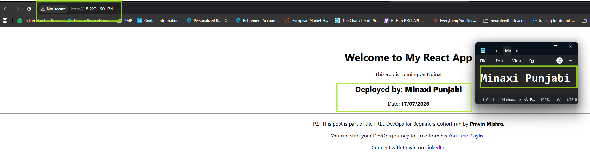

---

#### Screenshot 2 — Output of `ip a`

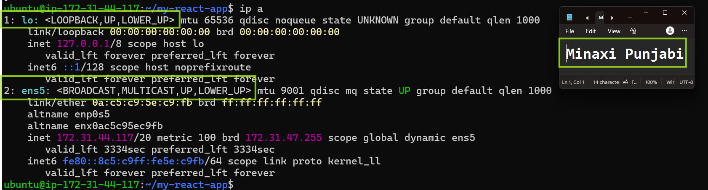

---

#### Screenshot 3 — Output of `sudo ss -tulpen`

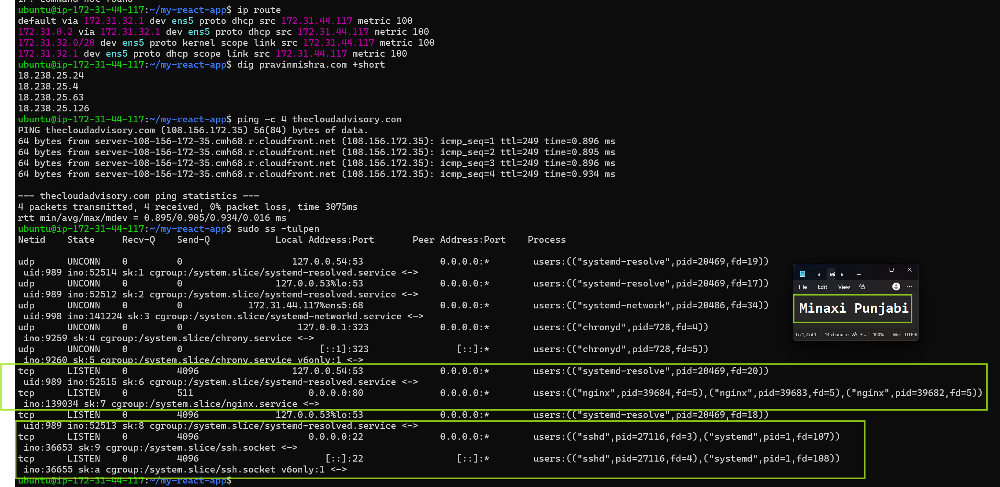

---

#### Screenshot 4 — Output of `sudo ufw status`

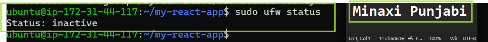

---

### Notes

Answer the following in your own words:

**1. What proves Nginx is listening on 0.0.0.0:80?**

Image reference: Output of `sudo ss -tulpen`, The line line tcp LISTEN 0.0.0.0:80 confirms it is listening there. 0.0.0.0  is bound to all network interfaces, not just localhost, so it can accept HTTP connections from any IP address, including external traffic from the internet. The process name nginx alongside the port confirms it's specifically Nginx holding this port open, not another service

---

**2. What proves SSH is active on port 22?**

Image reference: Output of `sudo ss -tulpen`The line line tcp LISTEN 0.0.0.0:22 sshd, confirms the SSH daemon (sshd) is actively listening on port 22 across all interfaces. This is what allows remote login to the server (e.g., via ssh ubuntu@<public-ip>).

---

**3. Did you find any unexpected open ports? Explain briefly.**

No unexpected ports were found. Aside from Nginx (port 80) and SSH (port 22), the only other listening services were chronyd (time sync) and systemd-resolved (DNS resolution), both bound only to loopback addresses (127.0.0.1, 127.0.0.53, 127.0.0.54), meaning they're not reachable from outside the server. This confirms only the two intended services, the web server and SSH, are externally exposed.

---

# Task 2 — Service Health & Systemd Validation (Nginx)

## Goal

Verify that Nginx is properly installed, running, enabled at boot, and safely configured.

### Evidence

#### Screenshot 1 — Output of `systemctl status nginx --no-pager`

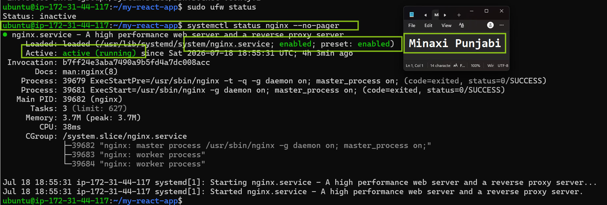

---

#### Screenshot 2 — Output of `sudo nginx -t`

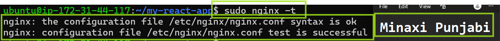

---

#### Screenshot 3 — Output of `sudo ss -lptn '( sport = :80 )'`

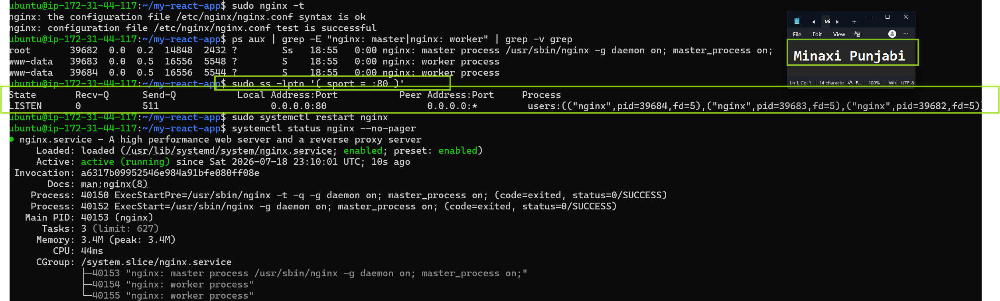

---

### Notes

Answer the following in your own words:

**1. What happens if Nginx fails to restart in production?**

 If Nginx fails to restart, the website becomes completely unreachable, since Nginx is the only process serving HTTP traffic on port 80. Any user visiting the site would get a connection error or timeout, since nothing would be listening on that port anymore. This is especially risky if the failure happens during a deployment or config change, since it means the site could go down with no automatic recovery, requiring manual intervention to diagnose and fix

---

**2. What's your basic rollback plan?**

 Always run sudo nginx -t first to validate the config syntax — before making any configuration change.
 This catches most errors before they ever reach a restart. If a restart is attempted and fails, the first step is to check systemctl status nginx --no-pager and sudo journalctl -u nginx --no-pager -n 50 to see the exact error.
 If the failure is due to a bad configuration change, the fix is to revert the config file back to its last known-good version (ideally from a backup or version control) and re-run sudo nginx -t followed by sudo systemctl restart nginx again. Keeping a backup copy of the working config before making changes is the simplest safeguard, since it allows an immediate rollback without needing to debug under pressure.

---

# Task 3 — Logs & Request Trace

## Goal

Verify real traffic flow and analyze logs to understand system behavior and errors.

### Evidence

#### Screenshot 1 — Output of `sudo tail -n 30 /var/log/nginx/access.log`

---

#### Screenshot 2 — Output of `sudo tail -n 30 /var/log/nginx/error.log`

---

#### Screenshot 3 — Output of `sudo journalctl -u nginx --no-pager -n 50`

---

### Notes

Answer the following in your own words:

**1. Were there any errors in the logs?**

- If yes, mention 1–2 example error lines from the logs and explain what each one means in simple terms.
- If no, explain what it means if the error log is empty or shows no recent errors during your check.

Write your answer here.

---

**2. If there were no errors, what does that indicate about the system?**

The command returned empty output or did not produce an explicit log error message. When /var/log/nginx/error.log is completely empty or shows no message, it generally indicates that Nginx itself is running cleanly, has no syntax errors, and is not running into low-level runtime crashes or missing static file faults, e.g. Config file issues.
---

**3. Based on the access logs, were your curl requests visible in the log entries? What does that prove about traffic flow?**

Specifically, the logs capture your initial GET request and the subsequent HEAD request (-I) targeting the /dev/null path:"GET /dev/null HTTP/1.1" 200 644 "-" "curl/8.18.0""HEAD /dev/null HTTP/1.1" 200 0 "-" "curl/8.18.0"What this proves about the traffic flowSuccessful external connectivity: The traffic successfully navigates through all external infrastructure layers (such as cloud firewalls, security groups, and routing tables) to reach the target instance.Nginx is listening and active: The web server is actively listening on port 80 and processing incoming external connections normally.SPA fallback routing configuration: Both requests returned an HTTP 200 OK status code, but the GET request delivered exactly 644 bytes of data (the exact size of the React HTML template shell you received earlier). This confirms that Nginx's configuration is using a catch-all fallback rule (like try_files). Because /dev/null does not exist as a physical file or distinct API route inside Nginx, the server handles the request by serving the root React application template instead of throwing a 404 error.

---

# Task 4 — System Resource Health Check (Capacity Red Flags)

## Goal

Assess server capacity and detect potential performance or failure risks.

### Evidence

#### Screenshot 1 — Output of `uptime`

---

#### Screenshot 2 — Output of `free -h`

---

#### Screenshot 3 — Output of `df -h`

---

#### Screenshot 4 — Output of `sudo du -sh /var/* | sort -h`

---

### Notes

Answer the following in your own words:

**1. Which resource looks most critical right now? (CPU/load, memory, or disk) Explain why.**

 None of the three resources show any critical signal at this moment — CPU is idle, memory has healthy available headroom with zero swap pressure, and disk is at a comfortable 64%. If forced to rank which one deserves the closest ongoing attention as this server scales, it would be disk, since it's the resource most likely to silently creep upward over time (via log growth or package cache accumulation) without any obvious symptom until it's suddenly critical — unlike CPU or memory pressure, which usually show visible slowness firs

---

**2. What happens if disk becomes 100% full in a production server?**

Logs stop being able to write new entries, which is especially dangerous because that's often exactly when you need logs most — during an active incident. Applications (including build tools and package managers) can fail or crash if they need scratch space to write temporary files. If a database were running locally, it could refuse writes or become corrupted. In severe cases, the OS itself can become unstable — even basic operations like logging in via SSH can fail if there's truly no disk space left for the system to work wit

---

# Task 5 — Configuration & Deployment Verification

## Goal

Ensure the correct React build is deployed and Nginx is serving it properly.

### Evidence

#### Screenshot 1 — Output of `ls -lah /var/www/html | head -n 20`

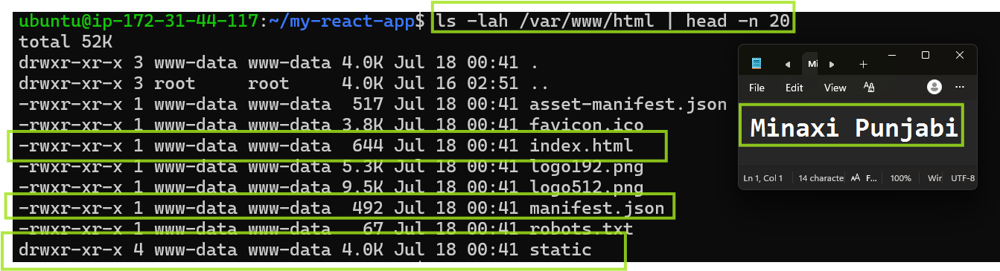

---

#### Screenshot 2 — Output of `grep -R "Deployed by" -n /var/www/html 2>/dev/null | head`

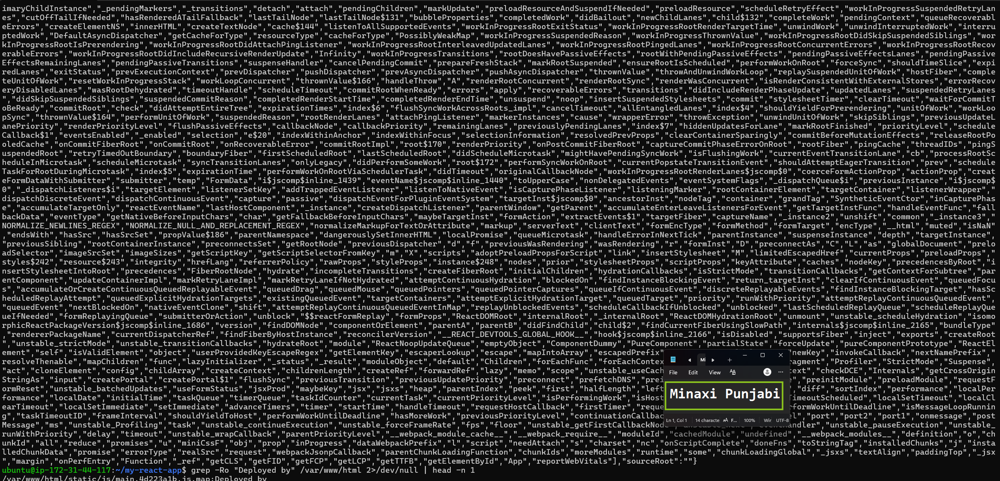

---

#### Screenshot 3 — Output of `grep -n "try_files" /etc/nginx/sites-available/default`

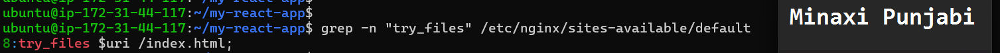

---

### Notes

Answer the following in your own words:

**1. How do you confirm that the correct version of the application is deployed?**

ls -lah /var/www/html confirmed the presence of a genuine Create React App production build — index.html, a static/ folder with compiled JS/CSS bundles, and standard CRA metadata files — all owned by www-data, the user Nginx's worker processes run as.
grep -R "Deployed by" confirmed the specific custom identifying text was compiled into the live JavaScript bundle and matched the original source via the accompanying source map — proving this exact build, not a stale or generic one, is what's live.
grep -n "try_files" confirmed Nginx's config correctly falls back to index.html for unmatched routes, ensuring the SPA behaves correctly for all application routes, not just the homepage.
Finally, this was cross-checked against the earlier curl test in Task 3, which showed the live server actually returning this exact index.html content over HTTP — tying the on-disk files to what's genuinely being served to real users.

---

# Task 6 — Nginx Configuration Failure Simulation

## Goal

Simulate a real-world Nginx misconfiguration and recover the service safely.

### Evidence

#### Screenshot 1 — Output of `sudo nginx -t` showing the syntax error (broken config)

---

#### Screenshot 2 — Output of `sudo nginx -t` showing syntax ok (fixed config)

---

#### Screenshot 3 — Output of `curl -I http://<public-ip>` confirming recovery (200 OK)

---

### Notes

Answer the following in your own words:

**1. What caused the configuration failure?**

What caused the configuration failure?
A missing semicolon; in /etc/nginx/sites-available/default was intentionally removed from the "try_files $uri /index.html;"

---

**2. How did you fix the issue?**

sudo nano /etc/nginx/sites-available/default - openned the editor and I added the semicolon I had deleted intentionaly earlier. 

---

**3. How can you avoid this kind of issue in real production systems?**

Always run nginx -t after any config edit, without exception, before restarting or reloading.
Keep Nginx config files in version control (git), so a bad change can be instantly reverted to a known-good state instead of manually retyped from memory.
Use a staging environment to test config changes before they ever touch production.
Where possible, automate config validation as part of a deployment pipeline, so a broken config is caught in CI and never reaches the live server at all.

---

# Task 7 — Web Application Failure Simulation

## Goal

Simulate missing deployment content and recover the application safely.

### Evidence

#### Screenshot 1 — Output of `curl -I http://<public-ip>` showing failure (non-200 response)

---

#### Screenshot 2 — Output of `curl -I http://<public-ip>` confirming recovery (200 OK)

---

### Notes

Answer the following in your own words:

**1. What caused the application to break in this scenario?**

The web root directory (/var/www/html) — the exact path Nginx serves content from — was emptied of all deployment files. Nginx itself remained running and correctly configured, but with no content present and no fallback file available either, it returned a 500 Internal Server Error instead of serving the React application.

---

**2. How did you fix the issue and restore the application?**

The original deployment had been safely backed up beforehand (moved to html_backup rather than deleted), so recovery involved removing the empty broken directory and moving the backup back into place at the correct path. Nginx was restarted to ensure it was serving cleanly from the restored files, and recovery was confirmed externally via curl -I, which returned 200 OK with identical content metadata (Content-Length, Last-Modified, ETag) to the pre-incident state — proving the exact same build was successfully restored.

---

**3. What steps would you take to prevent this kind of issue in real production systems?**

- Automated pre-deployment backups, so every release can be instantly rolled back without manual intervention.
- Deploying to a versioned, separate directory and atomically switching a symlink (e.g., /var/www/current) to point to it, rather than overwriting the live directory in place — this way a failed deploy never leaves the live path empty or half-written.
- CI/CD pipeline checks that verify a deployment actually succeeded (e.g., confirming index.html exists and is non-empty) before marking the release complete.
- Post-deployment health checks/monitoring that automatically verify the live site returns a healthy 200 response immediately after every deploy, catching this kind of failure within seconds rather than relying on someone noticing manually.

---

# Task 8 — Security & Reliability Review

## Goal

Review and reflect on the security and reliability practices applied during this assignment.

### Security & Reliability Notes

Answer the following in your own words:

**1. Why is SSH key-based authentication more secure than sharing passwords?**

SSH keys are more secure because they use a private key that stays on the device instead of a password that can be phished or stolen. This makes it much harder for hackers to guess or steal.

---

**2. Why should only required ports be open on a production server?**

Only the required ports should be open on a production server because every open port is a possible way for attackers to access the server. Closing unused ports reduces security risks and helps protect the server from unauthorized access and attacks.

---

**3. Why is it important for Nginx to be enabled on boot?**

It's important for Nginx to be enabled on boot so the web server starts automatically whenever the server restarts. This keeps your website or application available without requiring someone to start Nginx manually.

---

**4. What are the risks of sharing secrets, keys, or credentials publicly?**

Sharing secrets, keys, or credentials publicly can let unauthorized people access your systems, data, or accounts. This can lead to data theft, service disruption, unauthorized changes, or financial loss. It can lead to loosing data of users which can lead to legal complications and penalties and fines too.

---

**5. Why should cloud resources be stopped or terminated when they are no longer needed?**

Cloud resources should be stopped or terminated when they are no longer needed to save money, reduce security risks, and avoid wasting computing resources

---

# LinkedIn Post (Required)

## Evidence

#### LinkedIn Post URL

Paste your LinkedIn post URL here:

https://www.linkedin.com/posts/minaxi-punjabi_agenticai-systemsthinking-softwaredelivery-share-7485228098930606080-mByv/?utm_source=share&utm_medium=member_desktop&rcm=ACoAABqPfm0BltUSV7lY0aKhl1BWZCRBhv3K4iQ

---

#### Screenshot — Published LinkedIn post

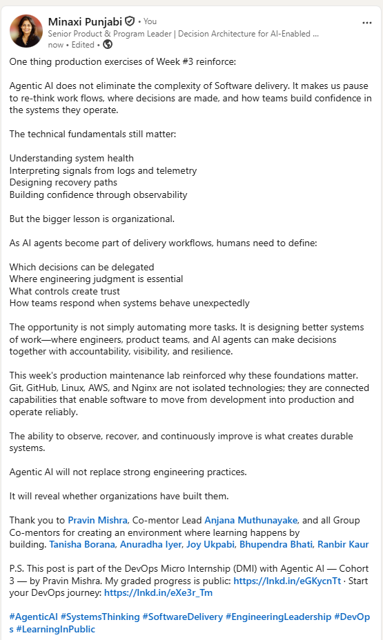

---

# Submission Instructions

- Add all required screenshots in your submission
- Full name must be visible in required screenshots
- Do not expose sensitive information (keys, passwords, account IDs)

---

# Completion Checklist

- [ ] Task 1: Screenshots (browser, ip a, ss -tulpen, ufw status) + Notes answered
- [ ] Task 2: Screenshots (nginx status, nginx -t, ss port 80) + Notes answered
- [ ] Task 3: Screenshots (access log, error log, journalctl) + Notes answered
- [ ] Task 4: Screenshots (uptime, free -h, df -h, du -sh) + Notes answered
- [ ] Task 5: Screenshots (ls html, grep deployed by, grep try_files) + Notes answered
- [ ] Task 6: Screenshots (nginx -t fail, nginx -t pass, curl recovery) + Notes answered
- [ ] Task 7: Screenshots (curl failure, curl recovery) + Notes answered
- [ ] Task 8: Security & Reliability Notes answered
- [ ] LinkedIn post published and URL submitted
- [ ] Full Name visible in all required screenshots
- [ ] No sensitive data exposed

---

## 📌 About DMI & CloudAdvisory

DevOps Micro Internship (DMI) is a project-based DevOps program run by Pravin Mishra (The CloudAdvisory) focused on real-world execution, systems thinking, and career readiness.

It helps learners build strong DevOps foundations with hands-on experience.

---

## 📌 Resources

- 🌐 DMI Official Website: https://pravinmishra.com/dmi  
- 🎓 DevOps for Beginners (Udemy): https://www.udemy.com/course/devops-for-beginners-docker-k8s-cloud-cicd-4-projects/  
- 🎓 Agentic AI DevOps with Claude Code: https://www.udemy.com/course/ultimate-agentic-ai-devops-with-claude-code/  
- 🎓 DevOps with Claude Code: Terraform, EKS, ArgoCD & Helm: https://www.udemy.com/course/devops-with-claude-code-terraform-eks-argocd-helm/  
- ▶️ YouTube Playlist: https://www.youtube.com/playlist?list=PLFeSNDtI4Cho  
- 🔗 Pravin Mishra (LinkedIn): https://www.linkedin.com/in/pravin-mishra-aws-trainer/  
- 🏢 CloudAdvisory (LinkedIn): https://www.linkedin.com/company/thecloudadvisory/

---

*This submission is part of DevOps Micro Internship (DMI) Cohort 3 — Agentic AI Track.*