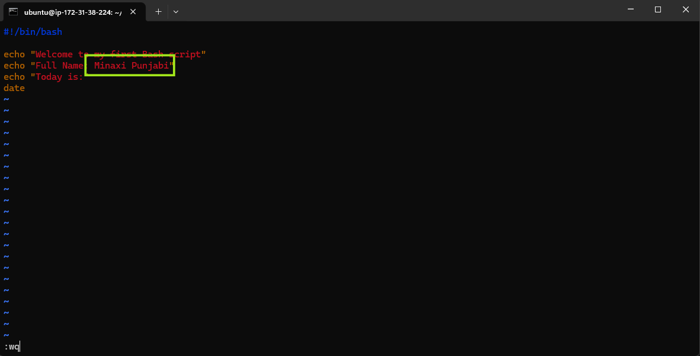

# Assignment 5 — Bash Script Automation Drill (OPS Checklist)

Part of the DevOps Micro Internship (DMI) Cohort 3 with Agentic AI

---

## Purpose

In this assignment, you will practice Bash scripting by building a series of small automation scripts covering environment setup, variables, arrays, loops, file conditionals, if-else logic, and functions. These scripts form the foundation of real-world Linux automation used in DevOps, cloud, and production support environments.

---

# Task 1 — Bash Environment & Workspace Setup

## Goal

Verify that Bash is available on your system and create a clean workspace for this assignment.

### Evidence

#### Screenshot 1 — Output of `echo $SHELL` and `bash --version`

---

#### Screenshot 2 — Output of `pwd` and `ls -lah` showing the scripts directory

---

### Notes

Answer the following in your own words:

**1. What is Bash?**

Bash is a command language interpreter and a Unix shell that reads and executes commands typed in a terminal or loaded from a script. It serves as the primary user interface for communicating with a computer operating system. Commands can automates tasks, manage files, and controls system software.

---

**2. What is the difference between shell and Bash?**

- Shell: This is an abstract, general term for any interface that lets a user interact with the operating system kernel by typing commands.

- Bash: This is a specific, concrete implementation of a shell (Bourne-Again SHell) created as a free software replacement for the original Bourne shell (sh).Think of shell as the generic vehicle category and Bash as a specific model of a car. 

---

**3. Why is it important to confirm the Bash version before writing scripts?**

- Feature Availability: Major versions introduce entirely new syntax and built-in capabilities, such as associative arrays which were added in Bash 4.0.

- Compatibility Protection: Writing code with features from Bash 5.0 will throw syntax errors and fail if executed on an older system like macOS, which defaults to Bash 3.2.

- Behavior Shifts: Minor changes in how commands or expansions operate between versions can introduce silent bugs if your script runs on an unverified version.

---

# Task 2 — Your First Bash Script

## Goal

Create your first Bash script, make it executable, and run it from the terminal.

### Evidence

#### Screenshot 1 — Content of `first-script.sh`

---

#### Screenshot 2 — Output of `./first-script.sh`

---

#### Screenshot 3 — Output of `ls -l first-script.sh` showing executable permission

---

### Notes

Answer the following in your own words:

**1. What is the purpose of `#!/bin/bash`?**

It informs the operating system to run the bash script commands and as a result of this commandthe o.s understands to use the Bash interpreter to tun the commands in the script file.

---

**2. Why do we use `chmod +x` before running a script?**

We want to execute the bash script so we make sure that the permissions on the file included executing it. We always perform check, validate changes (which we did with ls) then trust and deploy (in this case execute).
---

**3. What is the difference between running a script using `./script.sh` and `bash script.sh`?**

bash script.sh - the first command is bash this acts as a didatic command to the operating system to use the and run the bash script withitn the <FileName>.

./script.sh is more like a <path/FileName> and since a file could have on Read or Read+Write or Read+Execute etc permissions if we wish to use it as bash commands we need to explicitly have the #!/bin/bash command - if we want to have the bash interpretor execute the commands and also have to have the file posses the permission of being excutable.

---

# Task 3 — Variables: User Information Script

## Goal

Use variables to store and display user-related information.

### Evidence

#### Screenshot 1 — Content of `user-info.sh`

---

#### Screenshot 2 — Output of `./user-info.sh`

---

### Notes

Answer the following in your own words:

**1. What is a variable in Bash?**

When we want to allow user to give values that might be changing (rather than a permanently fixed value, e.g. user name of the team emmber who is editing the file, since it migth not always be the same individual) - We can assign a label which can hold values. so a lable like "Fname" represented in the Bash script as "$Fname" would be a way that references the First name depending on whatevr value teh user has stored in that label. 

---

**2. Why should we avoid spaces around the `=` sign when creating variables?**

Bash's syntax does not allow for spaces when assigning value to a variable. If we add spaces Bash will read each of the words as separate commands instead of storing value.
Correct
    f_name="Minaxi"
Error:
    f_name = "Minaxi"
    Bash tries to run f_name as a command
    = } argument
    and "Minaxi"} as a fixed value
    No storage, no f_name variable  

---

**3. How do you access the value stored inside a Bash variable?**

Preceed the charchter '$' to the variable no spaces to access teh stored value. E.g. $f_name 

Example from our scripts:  
    echo "$course_name"
Here, $course_name returns the value stored inside the course_name variable. 

---

# Task 4 — Arrays & Loops: Tools Checklist Script

## Goal

Use arrays and loops to print a checklist of tools used in Bash scripting.

### Evidence

#### Screenshot 1 — Content of `tools-checklist.sh`

---

#### Screenshot 2 — Output of `./tools-checklist.sh`

---

### Notes

Answer the following in your own words:

**1. What is an array in Bash?**

An array can be thought of like a list. It allows users to call any of the data that is part of that list by just one variable name. See more below.

---

**2. Why are arrays useful in scripts?**

Whereas a regular variable has one to one correspondence, one variable to can store one value. An array allows us to store several values like in a grocery shopping list, or to-dO list. If one were not to use arrays one would need to have a variable for each of the individual data that the user needed to store. 

So a guest list using regular variables would look like 
    guest1:"Ram"
    guest2:"John"
    guest3:"Athena"

Whereas storing guest list in an array would be 
    guest_list=("Ram" "John" "Athena")
    
---

**3. What does `"${tools[@]}"` mean?**

You should always use double quotes around array expansions in Bash unless you have a specific, intentional reason to split the text.

The standard rule is to write "${array[@]}" rather than ${array[@]}.

Why you must use quotes - When you omit quotes, Bash performs word splitting and globbing (filename expansion) on the values inside your array. This alters how data is processed, especially if your array elements contain spaces e.g. Guest_List = "Ram Manohar" "Jackie Chan" "Sharon Stone".
The differences in expansion"${my_array[@]}" (The Correct Way): Expands each element as a separate, individually quoted string. Spaces inside elements are perfectly preserved.${my_array[@]} (Unquoted): Expands all elements, but then breaks them apart at every single space, turning one element into multiple pieces

---

**4. What is the purpose of the `for` loop in this script?**

For loop helps one to repeat an action for a set condition is valid. 
In this case it goes through the entire value list in tools until the list is exhausted.
In this script, the following line creates an array called tools: 
		tools=("bash" "nano" "chmod" "echo" "ls" "pwd")

The array stores multiple tool names under one variable name.
The for loop goes through the array and displays each tool one by one:
		for tool in "${tools[@]}"
do
   		 echo "Tool available for practice: $tool"
done
During each loop iteration, the current item is stored in the tool variable. The for loop goes through each value in the tools array one by one. During each round, the current value is stored in the tool variable and printed in the terminal.
For example, during the first round, $tool contains bash. During the next round, it contains nano, and the loop continues until every tool has been printed.

---

# Task 5 — Loops: Number Counter Script

## Goal

Use loops to repeat a task multiple times.

### Evidence

#### Screenshot 1 — Content of `counter.sh`

Add your screenshot here.

---

#### Screenshot 2 — Output of `./counter.sh`

Add your screenshot here.

---

### Notes

Answer the following in your own words:

**1. What is a loop?**

Add your answer here.

---

**2. Why do we use loops in Bash scripting?**

Add your answer here.

---

**3. How many times did the loop run in your script?**

Add your answer here.

---

**4. What would you change if you wanted the loop to run 10 times?**

Add your answer here.

---

# Task 6 — Files & Conditionals: File Validation Script

## Goal

Use file checks and conditionals to verify whether files and directories exist.

### Evidence

#### Screenshot 1 — Output of `ls -lah ../test-folder`

Add your screenshot here.

---

#### Screenshot 2 — Content of `file-check.sh`

Add your screenshot here.

---

#### Screenshot 3 — Output of `./file-check.sh`

Add your screenshot here.

---

### Notes

Answer the following in your own words:

**1. What does `-d` check in Bash?**

Add your answer here.

---

**2. What does `-f` check in Bash?**

Add your answer here.

---

**3. Why should file and directory paths be stored in variables?**

Add your answer here.

---

**4. What happens if the file does not exist?**

Add your answer here.

---

# Task 7 — Conditionals: Pass or Retry Script

## Goal

Use if-else conditionals to make decisions based on a variable value.

### Evidence

#### Screenshot 1 — Content of `score-check.sh` with `score=85`

Add your screenshot here.

---

#### Screenshot 2 — Output showing `Result: Pass`

Add your screenshot here.

---

#### Screenshot 3 — Content of `score-check.sh` with `score=55`

Add your screenshot here.

---

#### Screenshot 4 — Output showing `Result: Retry`

Add your screenshot here.

---

### Notes

Answer the following in your own words:

**1. What is the purpose of if-else in Bash?**

Add your answer here.

---

**2. What does `-ge` mean?**

Add your answer here.

---

**3. Why should conditions be tested with different values?**

Add your answer here.

---

**4. How can conditionals help in automation scripts?**

Add your answer here.

---

# Task 8 — Functions: Final Bash Automation Script

## Goal

Create a final Bash script using functions to organize reusable code.

### Evidence

#### Screenshot 1 — Content of `final-automation.sh`

Add your screenshot here.

---

#### Screenshot 2 — Output of `./final-automation.sh`

Add your screenshot here.

---

#### Screenshot 3 — Output of `ls -lah` showing all created scripts

Add your screenshot here.

---

### Notes

Answer the following in your own words:

**1. What is a function in Bash?**

Add your answer here.

---

**2. Why are functions useful in scripts?**

Add your answer here.

---

**3. Which functions did you create in this script?**

Add your answer here.

---

**4. How does this final script combine variables, arrays, loops, conditionals, files, and functions?**

Add your answer here.

---

# LinkedIn Post (Required)

## Evidence

#### LinkedIn Post URL

Paste your LinkedIn post URL here:

`Add your URL here`

---

#### Screenshot — Published LinkedIn post

Add your screenshot here.

---

# Submission Instructions

- Add all required screenshots in your submission
- Full name must be visible in required screenshots
- All script files must be created and run successfully
- Required notes must be answered clearly for every task
- Do not expose sensitive information (keys, passwords, credentials)

---

# Completion Checklist

- [ ] Task 1: Environment setup verified, workspace created (Screenshots 1–2, Notes answered)
- [ ] Task 2: First script created, executed, permissions verified (Screenshots 1–3, Notes answered)
- [ ] Task 3: Variables script created and run (Screenshots 1–2, Notes answered)
- [ ] Task 4: Arrays and loops script created and run (Screenshots 1–2, Notes answered)
- [ ] Task 5: Counter loop script created and run (Screenshots 1–2, Notes answered)
- [ ] Task 6: File validation script created and run (Screenshots 1–3, Notes answered)
- [ ] Task 7: Pass/Retry conditional script tested with both values (Screenshots 1–4, Notes answered)
- [ ] Task 8: Final automation script created and run (Screenshots 1–3, Notes answered)
- [ ] All scripts run without errors
- [ ] Full Name visible in all required screenshots
- [ ] LinkedIn post published and URL submitted
- [ ] No sensitive data exposed

---

## 📌 About DMI & CloudAdvisory

DevOps Micro Internship (DMI) is a project-based DevOps program run by Pravin Mishra (The CloudAdvisory) focused on real-world execution, systems thinking, and career readiness.

It helps learners build strong DevOps foundations with hands-on experience.

---

## 📌 Resources

- 🌐 DMI Official Website: https://dmi.pravinmishra.com?utm_source=github&utm_medium=readme  
- 🎓 University: https://university.pravinmishra.com?utm_source=github&utm_medium=readme  
- 💬 Discord Community: https://discord.pravinmishra.com?utm_source=github&utm_medium=readme  
- 📝 Blog: https://dmi.pravinmishra.com/blog?utm_source=github&utm_medium=readme  
- ▶️ YouTube Playlist: https://www.youtube.com/playlist?list=PLFeSNDtI4Cho  
- 🔗 Pravin Mishra (LinkedIn): https://www.linkedin.com/in/pravin-mishra-aws-trainer/  
- 🏢 CloudAdvisory (LinkedIn): https://www.linkedin.com/company/thecloudadvisory/

---

*This submission is part of DevOps Micro Internship (DMI) Cohort 3 — Agentic AI Track.*