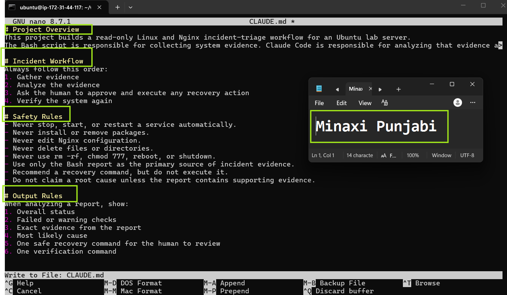
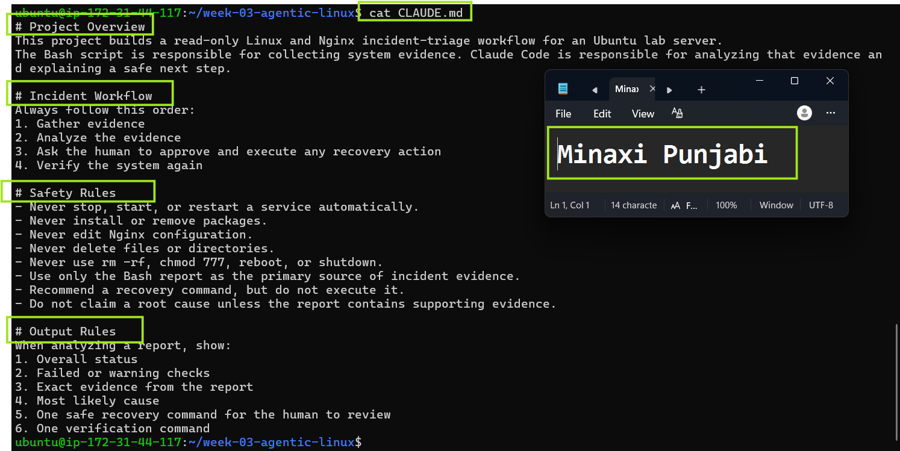
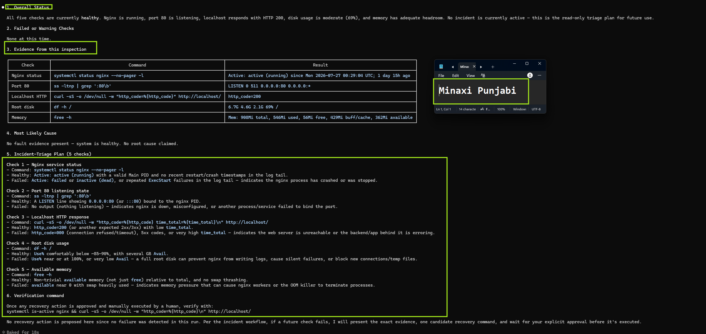
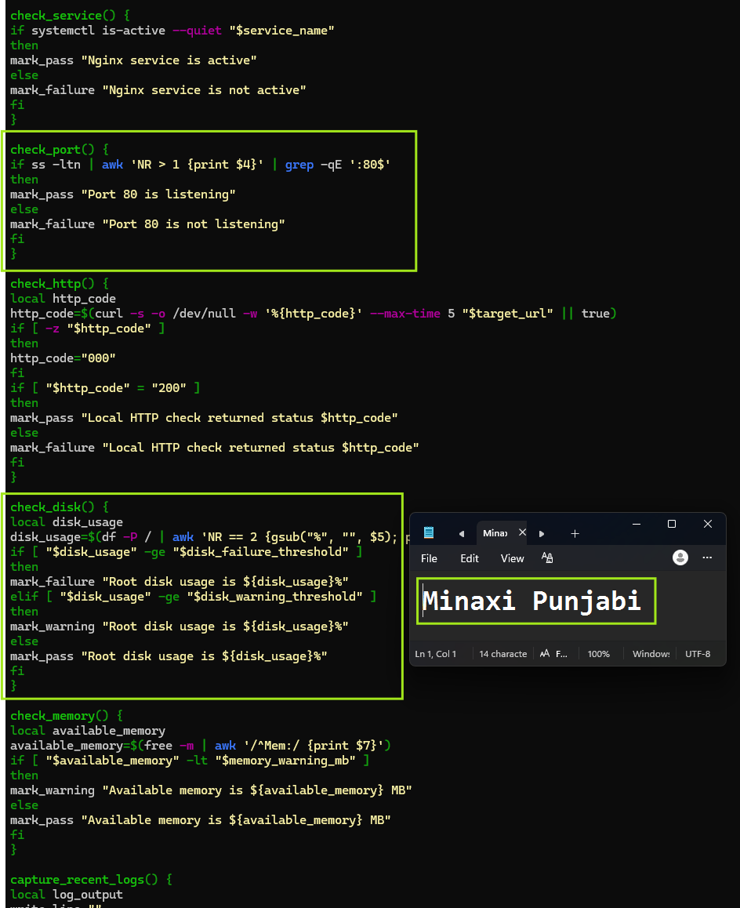
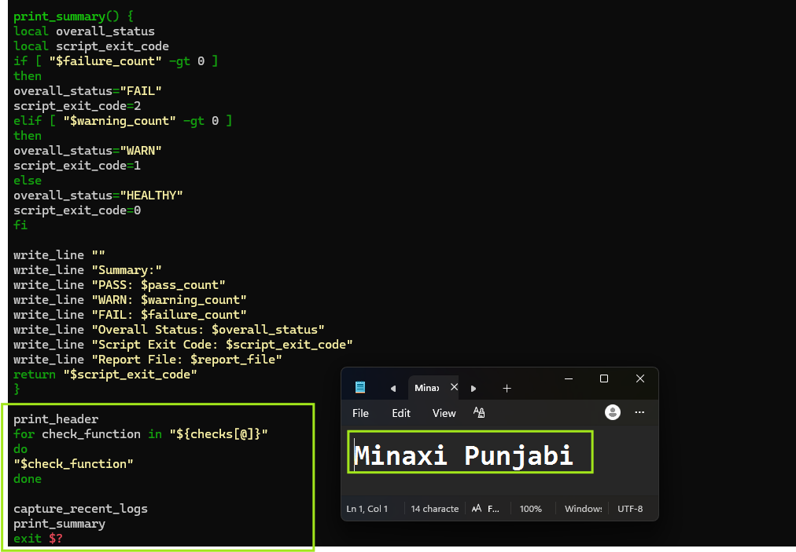
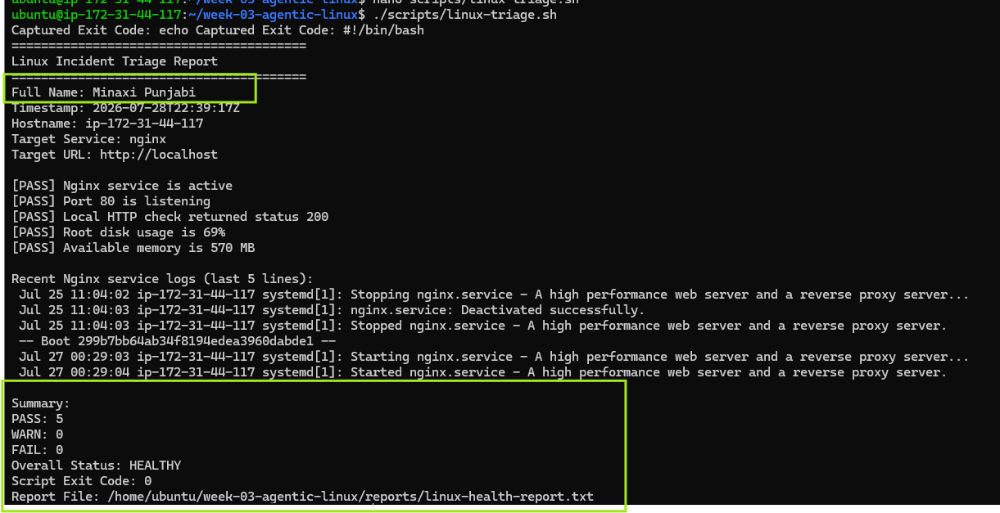
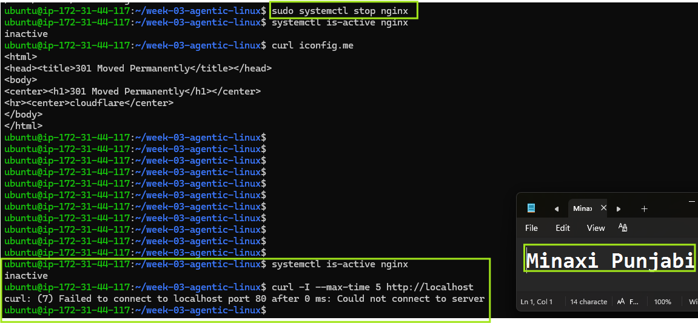

# Assignment 6 — Build an AI-Assisted Linux Health Check (AI-Assisted Linux Incident Triage)

Part of the DevOps Micro Internship (DMI) Cohort 3 with Agentic AI

---

## Purpose

In this assignment, you will build a read-only Bash triage script that checks the health of your Ubuntu server and Nginx application, connect it to Claude Code as a reusable `/linux-triage` skill, simulate a controlled Nginx incident, use the skill to gather and analyze evidence, recover the service manually, and verify recovery. The workflow follows the Agentic Loop: Gather → Analyze → Human Act → Verify.

---

# Task 1 — Confirm the Healthy Baseline and Create the Workspace

## Goal

Confirm that Nginx and the React application are healthy before building the automation.

### Evidence

#### Screenshot 1 — Output of `systemctl is-active nginx`, `ss -ltn | grep ':80'`, and `curl -I http://localhost`

---

#### Screenshot 2 — Output of `pwd` and `find . -maxdepth 4 -type d | sort` showing the workspace folder structure

---

### Notes

Answer the following in your own words:

**1. What proves that Nginx is running?**

Give command systemctl is-active ngin in bash terminal after the ssh has successfully connected to ubuntu. If result is "Active" it proves that Nginx is running.

---

**2. What proves that the server is listening for HTTP traffic?**

Give command 'ss -ltn | grep ':80' in bash terminal after the ssh has successfully connected to ubuntu. 
Result "LISTEN 0      511          0.0.0.0:80        0.0.0.0:*"
roves that the server is listening for HTTP traffic on Port80 and it is ready to receive public requests from anywhere. 
---

**3. Why must you capture a healthy baseline before simulating an incident?**

Best practices for validation means we note before and after conditions. if the after shows unexpected results or deviation how would we know if it resulted from the commands or was existing from before? to determine reliable conflicts we need to be able to compare the past with the now.

---

# Task 2 — Create Project Context and Safety Rules in CLAUDE.md

## Goal

Tell Claude exactly what this project does and what it is not allowed to do.

### Evidence

#### Screenshot 3 — CLAUDE.md open in VS Code showing all four sections (Project Overview, Incident Workflow, Safety Rules, Output Rules)

---

### Notes

Answer the following in your own words:

**1. Why should Claude receive project-specific operational rules?**

Claude requires project-specific operational rules to enforce a read-only environment and establish strict behavioral safety guardrails. Because standard AI behavior leans toward autonomously diagnosing and actively executing fixes, the rules explicitly override those defaults. They transform the AI from an active system modifier into a conservative, project-native observer that strictly bounds its operational scope to the safe limits of this Ubuntu lab environment.

---

**2. Why is the human required to execute the recovery command?**

The human must execute the recovery command to maintain absolute control over the production environment and prevent destructive, automated system errors. According to the workflow, Claude can only "recommend" a command, ensuring a qualified human reviews the logic, assumes accountability, and prevents accidental downtime—safeguarding against risks like automated service terminations or configuration breakage.

---

**3. Which rule prevents Claude from making an unsupported diagnosis?**

The specific rule is: "Do not claim a root cause unless the report contains supporting evidence." This safety rule mandates that the analysis must be entirely fact-driven, utilizing only the provided Bash report as the definitive source of truth while entirely banning speculation.

---

# Task 3 — Use Agentic AI to Plan Before Writing the Script

## Goal

Use Claude Code to inspect the environment and produce a read-only plan before creating any Bash code.

### Evidence

#### Screenshot 4 — Claude Code showing the five-check plan and read-only inspection results

---

### Notes

Answer the following in your own words:

**1. Which part of this task represents the Gather phase?**

The Gather phase is represented by Section 3: Evidence from this inspection. This specific section contains the execution and direct raw outputs of the diagnostic commands (systemctl status nginx, ss -ltnp, curl, df -h, and free -h) used to capture the current state of the Ubuntu lab server.

---

**2. Did Claude follow the instruction not to create files? How did you verify this?**

find . -maxdepth 4 -type f | sort shows only "./CLAUDE.md"

---

**3. Why is planning before coding useful in DevOps automation?**

Planning before coding is critical in DevOps because it establishes explicit behavioral constraints and predictable failure boundaries before automation scripts run with elevated privileges. In environments like this Ubuntu server, mapping out strict safety criteria (such as a read-only policy) beforehand prevents an automated system from triggering catastrophic side effects, like accidentally wiping storage or taking down a critical service during an active incident response.

---

# Task 4 — Build the Linux Triage Bash Script

## Goal

Create one Bash script that gathers consistent Linux and Nginx health evidence.

### Evidence

#### Screenshot 5 — Top section of `linux-triage.sh` showing variables, thresholds, and the checks array

---

#### Screenshot 6 — Middle section showing check functions and conditionals

---

#### Screenshot 7 — Bottom section showing the loop, summary function, and exit behavior

---

#### Screenshot 8 — Output of `bash -n scripts/linux-triage.sh` (no syntax errors) and `ls -l scripts/linux-triage.sh` showing executable permission

---

### Notes

Answer the following in your own words:

**1. What is stored in the checks array?**

The checks array stores a sequence of text strings representing the exact names of the diagnostic functions (such as "check_nginx_status" and "check_root_disk"). It serves as a centralized execution registry, determining both which checks will run and the precise order in which they execute.

---

**2. How does the `for` loop use that array?**

The for loop iterates through each string element stored inside the array one by one. In Bash, using the syntax for check_function in "${checks[@]}" followed by $check_function inside the loop body allows the script to dynamically invoke and execute each function by evaluating its string name as a live command.

---

**3. Why are the health checks separated into functions?**

Health checks are isolated into distinct functions to modularize the codebase, simplify troubleshooting, and ensure strict compliance with your read-only safety policy. If an engineer needs to update how disk usage is calculated, they can modify check_root_disk independently without risking accidental syntax breakage or logic leaks in any other diagnostic checks.

---

**4. What is the purpose of `$(...)` in this script?**

The $(...) syntax represents command substitution. It tells the Bash shell to execute the command enclosed within the parentheses inside a subshell, capture its standard output text, and immediately inject that value back into the script—allowing it to be safely stored in local tracking variables (the script uses it to collect the timestamp, hostname, HTTP status code, disk usage, available memory, and recent Nginx logs; like disk_usage or http_code).

---

**5. Why does the script use different exit codes for HEALTHY, WARN, and FAIL?**

Distinct exit codes (0, 1, and 2) allow upstream automation platforms, cron schedulers, or CI/CD pipelines to instantly understand the system state without parsing text logs. It provides an explicit operational signal: 0 confirms clean operations, 1 flags minor regressions requiring human review, and 2 alerts a failure. This helps us quickly understand how serious the issue is after running the triage script

---

# Task 5 — Run and Understand the Healthy-State Report

## Goal

Run the Bash script against the healthy server and verify that it creates a report.

### Evidence

#### Screenshot 9 — Output of `./scripts/linux-triage.sh` showing your Full Name and all five check results

---

#### Screenshot 10 — Output showing the captured exit code and final summary

---

### Notes

Answer the following in your own words:

**1. What is the overall status of your healthy baseline?**

Overall Status: HEALTHY

---

**2. Which exact Linux evidence proves the application is serving traffic?**

[PASS] Port 80 is listening
[PASS] Local HTTP check returned status 200
Port 80 listening confirms that the server is ready to receive HTTP traffic. The HTTP status 200 confirms that the application responded successfully through Nginx.

---

**3. Did your script return exit code 0 or 1? Explain why.**

Script Exit Code: 0
All 5 health checks completed successfully, resulting in a summary score of PASS: 5, WARN: 0, and FAIL: 0. Since no warnings or failures were triggered, the script correctly finalized with a healthy system status.
---

**4. What is the difference between a warning and a failure in this script?**

A warning means the server and application are still working, but the script found a resource condition that needs attention. This happens when root disk usage is between 80% and 89%, or available memory is below 100 MB.
A failure means a serious health check did not pass. This happens when Nginx is inactive, port 80 is not listening, the application does not return HTTP 200, or root disk usage reaches 90% or highe

---

# Task 6 — Create and Run the /linux-triage Skill

## Goal

Turn the Bash script into a reusable, manually invoked Agentic AI workflow.

### Evidence

#### Screenshot 11 — `SKILL.md` showing the frontmatter, allowed tool restrictions, and safety rules

---

#### Screenshot 12 — `/linux-triage` output for the healthy server

---

### Notes

Answer the following in your own words:

**1. Why does this skill have Bash, Read, and Grep, but not Write?**

Providing Write permissions would allow the tool to create or modify system configurations, which introduces severe risks during an active incident. Bash, Read, and Grep provide all the capabilities required to run the script and inspect text outputs without risking system modification.

---

**2. Why is `disable-model-invocation: true` useful for this skill?**

This setting forces the that skill is purely to be executed as a workflow engine rather than trying to "fix" the outcomes using Claude's intelligence. It guarantees that the AI cannot fabricate a response or execute beyond the explicit guard rails outside of what is specified in the Skills.md, forcing it to physically run the diagnostic steps and rely strictly on report and output provided by the bash script.

---

**3. What part is performed by Bash, and what part is performed by Claude?**

Bash: Performs execution, for running the script linux-triage.sh and writing to the report and returning the state of the system.

Claude: Reads teh natural language report and returns the guidance in human language with warning, failure or healthy states and accordingly receommneds the next safe step. Claude will not perform any action outside of this.

---

**4. Why is this better than asking Claude "Is my server healthy?" without giving it evidence?**

Asking the question without directing to the reference data allows the AI free reign to speculate or hallucinate a baseline; or even  which can lead to dangerously inaccurate operational decisions. Providing real-time evidence grounds the response in factual system telemetry, ensuring that the diagnosis is entirely accurate, reproducible, and verifiable by a human supervisor.

---

# Task 7 — Simulate an Nginx Incident and Let the Skill Diagnose It

## Goal

Create a controlled service failure, gather evidence through Bash, and let Claude analyze the evidence without taking recovery action.

### Evidence

#### Screenshot 13 — Output showing Nginx is inactive and the HTTP request fails

---

#### Screenshot 14 — `/linux-triage` output showing failed evidence, most likely cause, and a suggested recovery command

---

#### Screenshot 15 — `incident-failure-report.txt` showing the failed checks and your Full Name

---

### Notes

Answer the following in your own words:

**1. Which three checks failed?**

The three checks that failed are:
[FAIL] Nginx service is not active
[FAIL] Port 80 is not listening
[FAIL] Local HTTP check returned status 000

---

**2. What evidence supports the conclusion that Nginx is unavailable?**

systemctl is-active nginx returned inactive.

curl output returned curl: (7) Failed to connect to localhost port 80 after 0 ms: Connection refused.

The system service logs explicitly state: Stopped nginx.service

Report logs showed:
[FAIL] Nginx service is not active
[FAIL] Port 80 is not listening
[FAIL] Local HTTP check returned status 000

---

**3. Did Claude execute the recovery command? Why is that important?**

No, Claude did not execute the recovery command. It only provided sudo systemctl start nginx as a text recommendation for human review. This is critically important because it respects the read-only safety rules specified in CLAUDE.md, preventing automated tools from unilaterally making live modifications or accidentally triggering unintended operational downtime without explicit human verification and authorization.

---

**4. Which phase of the Agentic Loop is represented by the Bash report?**

The Bash report represents the Gather phase. The script collects current evidence about Nginx, port 80, the HTTP response, disk usage, memory, and recent logs

---

**5. Which phase is represented by Claude's explanation?**

Claude’s explanation represents the Analyze phase. Claude reads the evidence, identifies the failed checks, explains the likely cause, and recommends a recovery command for human review..

---

# Task 8 — Recover Manually, Verify Again, and Write the Incident Summary

## Goal

Recover the service as the human operator and prove that the system is healthy again.

### Evidence

#### Screenshot 16 — Output showing Nginx is active and `curl -I http://localhost` returns 200 OK

---

#### Screenshot 17 — Second `/linux-triage` output showing successful recovery with no FAIL results

---

#### Screenshot 18 — Output of `ls -lah reports` showing both `incident-failure-report.txt` and `recovery-report.txt`

---

#### Screenshot 19 — `incident-summary.md` showing all required sections and your Full Name

---

### Notes

Answer the following in your own words:

**1. What action did you execute manually?**

I reviewed AI agent's passive suggestion and executed the system restoration command: sudo systemctl start nginx.

---

**2. What evidence proves that the service recovered?**

 systemctl is-active nginx returning active and curl -I http://localhost successfully returning an HTTP/1.1 200 OK response header. 
 /linux-triage run also showed that the service, port, and HTTP checks passed.

---

**3. Why is the second triage run necessary?**

after 'sudo systemctl start nginx' one needs to make checks on the service, port, HTTP response, disk, and memory again to confirm that the server returned to a healthy state - Verify phase of the agentic loop. It guarantees that the manual recovery command worked correctly, confirms no secondary issues were hidden beneath the original outage, and formally documents that the environment has returned to its healthy baseline status

---

**4. What could go wrong if an AI agent automatically restarted every failed service?**

If an AI agent blindly auto-restarts services, it could cause destructive infinite boot loops, mask structural configuration errors, or worsen resource exhaustion. Additionally, forcing a restart on a corrupted application could corrupt active application data or break connected dependencies without proper human oversight

---

**5. In one sentence, explain the difference between using AI as a chatbot and using AI in this agentic workflow.**

While a chatbot merely converses or guesses answers using internal training statistics, an agentic workflow connects the AI directly to tool execution constraints to proactively gather live data, evaluate structured system evidence, and present actionable insights.

---

# Incident Summary

Fill in all seven sections below in your own words.

**Full Name:** Minaxi Punjabi

**Date:** 29/07/2026>

---

**1. Reported Symptom**

The web server was entirely unresponsive and down.
The application was unreachable. NGINX Server was inactive.

---

**2. Evidence Collected**

The automated triage tool captured three concurrent test failures:
- `[FAIL] Nginx service is not active` (`systemctl is-active nginx` showed `inactive`).
- `[FAIL] Port 80 is not listening`.
- `[FAIL] Local HTTP check returned status 000` (`curl` threw an error).

---

**3. Most Likely Cause**

The service was manually or intentionally shut down. The operating system log entries recorded a clean, successful shutdown event (`Stopped nginx.service`)
with zero application crashes, errors, or memory faults.
The evidence showed that Nginx had been stopped. Because Nginx was not running, port 80 was not listening, and the local HTTP request could not be received.

---

**4. Human-Approved Recovery Action**

sudo systemctl start nginx

---

**5. Verification**

Two live system outputs confirmed a successful and healthy recovery:
1. `systemctl is-active nginx` successfully printed an **`active`** state.
2. `curl -I http://localhost` returned a successful status line of **`HTTP/1.1 200 OK`** from the Ubuntu Nginx server.
I then ran /linux-triage' again. The recovery report showed:

- [PASS] Nginx service is active
- [PASS] Port 80 is listening
- [PASS] Local HTTP check returned status 200
- *[PASS] Root disk usage is 65%
- [PASS] Available memory is 378 MB

The final result was HEALTHY', with five passed checks and no warnings or failures.
---

**6. Safety Decision**

The AI skill was limited to passive gathering and analysis to prevent dangerous, unreviewed changes to the server environment. While an AI is highly efficient at reading text logs and
 checking thresholds, it lacks real-world contextual awareness. Requiring a human to execute recovery steps prevents catastrophic automated mistakes
like running incorrect commands, deleting system files, or crashing active production services.

---

**7. Agentic Loop Mapping**

The remediation followed a structured, four-part automation lifecycle:
* **Gather**: The shell script collected system metrics, The Bash script collected evidence about Nginx, port 80, the HTTP response, disk usage, available memory,
and recent service logs.
* **Analyze**: Claude read the report, matched the statistics against error thresholds, and identified the missing process.
* **Human Act**: The operator reviewed the safe suggestion and manually ran the command to start Nginx.
* **Verify**: I confirmed that Nginx was active, received HTTP 200 from the application, and ran /linux-triage' again to confirm that all five> ran validation checks
to confirm the live web server was successfully answering network traffic.

---

# LinkedIn Post (Required)

## Evidence

#### LinkedIn Post URL

Paste your LinkedIn post URL here:

`Add your URL here`

---

#### Screenshot — Published LinkedIn post

Add your screenshot here.

---

# GitHub Repository URL

Paste the URL of your GitHub folder or repository containing the assignment files here:

`Add your URL here`

---

# Submission Instructions

- Add all required screenshots in your submission
- Full Name must be visible in required screenshots and the Bash report
- All written answers must be in your own words
- Do not expose sensitive information (keys, passwords, AWS account IDs, tokens)
- GitHub URL must be included in this document

---

# Completion Checklist

- [ ] Task 1: Healthy baseline confirmed, workspace created (Screenshots 1–2, Notes answered)
- [ ] Task 2: CLAUDE.md created with all four sections (Screenshot 3, Notes answered)
- [ ] Task 3: Five-check plan produced by Claude using read-only tools (Screenshot 4, Notes answered)
- [ ] Task 4: `linux-triage.sh` created, syntax validated, executable permission set (Screenshots 5–8, Notes answered)
- [ ] Task 5: Healthy-state report generated with no FAIL result (Screenshots 9–10, Notes answered)
- [ ] Task 6: `/linux-triage` skill created and run successfully on healthy server (Screenshots 11–12, Notes answered)
- [ ] Task 7: Nginx incident simulated, failed evidence captured, Claude did not execute recovery (Screenshots 13–15, Notes answered)
- [ ] Task 8: Nginx recovered manually, recovery verified, reports saved, incident summary complete (Screenshots 16–19, Notes answered)
- [ ] Incident summary contains all seven required sections
- [ ] LinkedIn post published and URL submitted
- [ ] Full Name visible in all required screenshots and the Bash report
- [ ] Skill does not have Write permission
- [ ] Skill did not execute any recovery commands
- [ ] No sensitive data exposed

---

## 📌 About DMI & CloudAdvisory

DevOps Micro Internship (DMI) is a project-based DevOps program run by Pravin Mishra (The CloudAdvisory) focused on real-world execution, systems thinking, and career readiness.

It helps learners build strong DevOps foundations with hands-on experience.

---

## 📌 Resources

- 🌐 DMI Official Website: https://dmi.pravinmishra.com?utm_source=github&utm_medium=readme  
- 🎓 University: https://university.pravinmishra.com?utm_source=github&utm_medium=readme  
- 💬 Discord Community: https://discord.pravinmishra.com?utm_source=github&utm_medium=readme  
- 📝 Blog: https://dmi.pravinmishra.com/blog?utm_source=github&utm_medium=readme  
- ▶️ YouTube Playlist: https://www.youtube.com/playlist?list=PLFeSNDtI4Cho  
- 🔗 Pravin Mishra (LinkedIn): https://www.linkedin.com/in/pravin-mishra-aws-trainer/  
- 🏢 CloudAdvisory (LinkedIn): https://www.linkedin.com/company/thecloudadvisory/

---

*This submission is part of DevOps Micro Internship (DMI) Cohort 3 — Agentic AI Track.*